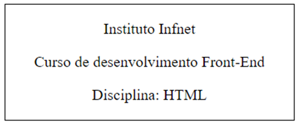

    

# Teste de Performance 2

## Exercício 14

Crie uma tag div que possui largura de 300px e conteúdo conforme abaixo:

    

Sobre a estilização do texto, deverão ser observados os seguintes aspectos, a serem configurados com o uso de propriedades CSS: 

- Tipo de fonte: Verdana;  
- Tamanho de fonte: 12 pixels; 
- Alinhamento: centralizado horizontalmente; 
- Espaçamento entre letras: 1.3px; 
- Cor de texto: Roxo.
